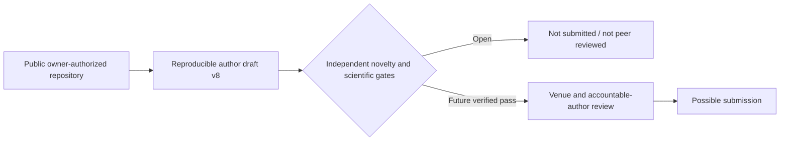

# Composable assurance for sovereign digital currency (CBDC)

This repository preserves the complete research and publication package for:

> **Composable assurance for sovereign digital currency (CBDC): An evidence-gated qualification framework**

Author: **Zubaer Mahmood Zubraj**  
ORCID: [0009-0004-3251-3385](https://orcid.org/0009-0004-3251-3385)

Repository owner and public-release authority: **Zubaer Mahmood Zubraj**
([`@zmzubraj`](https://github.com/zmzubraj)). The owner authorized this
repository to remain publicly accessible on 30 August 2026. That decision
authorizes public hosting; it does not imply journal submission, peer review,
institutional endorsement, or acceptance.

The repository contains the preserved v7 submission package, the journal-neutral v8 author draft, a reversible provisional JFMI adaptation, source figures, machine-readable results, a bounded local research prototype, tests, provenance records, and the schema-v4 research-case audit trail.

## Start here

- Current journal-neutral package: [`10_Working_Draft_v8/artifact_v8/`](10_Working_Draft_v8/artifact_v8/)
- Author manuscript: [`10_Working_Draft_v8/artifact_v8/output/Composable_Assurance_CBDC_Author_Draft_v8.pdf`](10_Working_Draft_v8/artifact_v8/output/Composable_Assurance_CBDC_Author_Draft_v8.pdf)
- Reproduction instructions: [`10_Working_Draft_v8/artifact_v8/README.md`](10_Working_Draft_v8/artifact_v8/README.md)
- Research-case status: [`research-case/INDEX.md`](research-case/INDEX.md)
- Publication-readiness evidence: [`10_Working_Draft_v8/artifact_v8/docs/COMPLETION_EVIDENCE_MATRIX_V8.md`](10_Working_Draft_v8/artifact_v8/docs/COMPLETION_EVIDENCE_MATRIX_V8.md)

## Verified local snapshot

- Prototype/model tests: **14/14 passed**
- Journal-neutral verifier: **PASS**
- Provisional JFMI verifier: **PASS_WITH_AUTHOR_GATES**
- Package integrity: **164/164 checksums passed**
- Manuscript: 17 pages, 185-word abstract, 6 keywords, 44 cited references, 16 figures, and 22 tables
- Novelty status: **UNRESOLVED**; the package does not claim universal novelty, field validation, production safety, or national-scale deployment

These are bounded mechanical and developmental checks. They are not peer review, institutional approval, editorial acceptance, or field validation.

## Repository and licensing status

- Canonical GitHub location: <https://github.com/zmzubraj/composable-assurance-cbdc>
- Repository visibility: **public, owner-authorized research release**
- Manuscript status: **journal-neutral author draft v8; not submitted and not peer reviewed**
- Canonical research phase: `INTAKE`; novelty `UNRESOLVED`; solution viability
  `ASSERTED_ONLY`; acceptance readiness `NOT_ASSESSABLE`
- Software and repository tooling: MIT License; see [`LICENSE`](LICENSE)
- Manuscript and original-figure content: proposed CC BY 4.0, but author confirmation remains required; see [`10_Working_Draft_v8/artifact_v8/CONTENT_LICENSE.md`](10_Working_Draft_v8/artifact_v8/CONTENT_LICENSE.md)
- Third-party source materials retain their original terms and are not relicensed by this repository
- Archival DOI: not yet assigned

## Submission gates

The final journal, affiliation, postal address, corresponding-author designation, conflict statement, AI-use wording, content licence, DOI/archival deposit, portal preview, and final submission remain accountable-human gates. Public visibility is resolved; JFMI is only a provisional trial target.

`09_Internal_Validation_Not_Submitted/Plagiarism_Check.pdf` is an internal preflight and is not a certified iThenticate/Turnitin report. Internal validation files should not be submitted to a journal unless specifically requested and reviewed.
